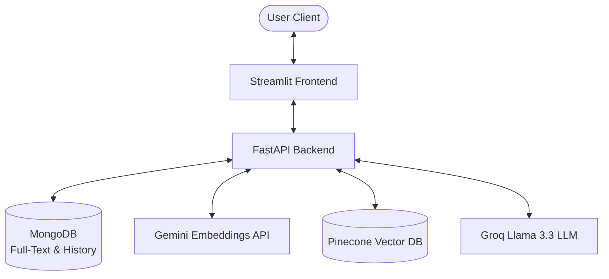

# 🎓 TutorRAG - AI-Powered Learning Assistant

TutorRAG is an educational platform designed to empower students and teachers through AI-powered document interactions. The application uses **Retrieval-Augmented Generation (RAG)** to index textbooks and notes, allowing students to ask questions, generate multiple-choice quizzes, and track their learning progress.

---

## 🚀 Features

### 👨‍🏫 For Teachers
- **Document Upload & Indexing**: Upload PDF textbook chapters or notes.
- **Targeted Material**: Assign documents to specific grade levels.
- **RAG Pipeline**: Automatically chunk and embed documents into a vector database.

### 🧑‍🎓 For Students
- **Smart Chat & QA**: Query uploaded materials for your specific grade level.
- **Instant Source Attributions**: View exactly which documents/sources were referenced to generate answers.
- **Automated Quiz Generation**: Generates custom multiple-choice quizzes based on local study materials using LLMs.
- **Performance History**: Attempt quizzes and review scores/past performance.

---

## 🏗️ Architecture & Technology Stack



- **Frontend**: Streamlit
- **Backend Framework**: FastAPI
- **Embeddings**: `models/gemini-embedding-001` (Google Generative AI)
- **Large Language Model (LLM)**: `llama-3.3-70b-versatile` (Groq API)
- **Databases**:
  - **MongoDB**: Used for persistent storage of user profiles, document full-text chunks, chat history, and quiz progress.
  - **Pinecone**: Used for semantic vector search.
- **Package Management**: `uv`

---

## 📂 Directory Layout

```text
AI-Teaching-Assistant/
├── client/                 # Streamlit Frontend Client
│   ├── assets/             # Images & static assets
│   ├── main.py             # Streamlit entry point
│   └── requirements.txt    # Client dependencies
│
├── server/                 # FastAPI Backend Server
│   ├── auth/               # User registration, schemas, password hashing, and authentication
│   ├── chat/               # Chat and quiz generation service logic and routes
│   ├── config/             # Database (MongoDB) client configurations
│   ├── doc/                # Document upload, chunking, and Pinecone vector store ingestion
│   ├── main.py             # FastAPI entry point
│   ├── requirements.txt    # Server dependencies
│   └── test.py             # Test configuration script
│
├── pyproject.toml          # UV project configuration
├── uv.lock                 # Lock file for python dependencies
├── .gitignore              # Files to ignore in Git
└── README.md               # Project documentation
```

---

## ⚙️ Prerequisites & Installation

Ensure you have python `>=3.14` and **uv** installed.

### 1. Clone the Repository
```bash
git clone https://github.com/indrareddy12/AI-Teaching-Assistance.git
cd AI-Teaching-Assistant
```

### 2. Set Up Environment Variables
Create a `.env` file in the root directory (or separate `.env` files in `server/` and `client/` directories) with the following variables:

```ini
# Backend URL (used by the Streamlit client)
BACKEND_URL=http://localhost:8000

# Database Configurations
MONGO_URI=mongodb://localhost:27017
MONGO_DB_NAME=tutor_rag_db

# API Credentials
GOOGLE_API_KEY=your_gemini_api_key
PINECONE_API_KEY=your_pinecone_api_key
GROQ_API_KEY=your_groq_api_key

# Pinecone Vector Index Settings
PINECONE_INDEX_NAME=tutor-rags
PINECONE_ENV=us-east-1
```

### 3. Install Dependencies
You can install the dependencies globally or within a virtual environment. Since `uv` is recommended:

```bash
# Set up a virtual environment and sync dependencies
uv venv
uv pip install -r requirements.txt
```

---

## 🏃 Running the Application

### Step 1: Start the Backend Server (FastAPI)
Run the FastAPI application from the repository root:
```bash
cd server
uvicorn main:app --reload --port 8000
```
The documentation will be available at [http://localhost:8000/docs](http://localhost:8000/docs).

### Step 2: Start the Frontend Client (Streamlit)
Open a new terminal window, navigate to the client folder, and start Streamlit:
```bash
cd client
streamlit run main.py
```
The interface will launch in your browser (typically at [http://localhost:8501](http://localhost:8501)).

---

## 🔒 Authentication & API Endpoints

The API uses **HTTP Basic Auth** for secure requests. Passwords are encrypted in MongoDB using `bcrypt`.

| Method | Endpoint | Description | Access |
| :--- | :--- | :--- | :--- |
| **POST** | `/signup/student` | Registers a student profile | Public |
| **POST** | `/signup/teacher` | Registers a teacher profile | Public |
| **GET** | `/login` | Authenticates user credentials | Student / Teacher |
| **POST** | `/upload_docs` | Ingests PDF file to DB/Pinecone | Teacher |
| **POST** | `/chat` | Queries chatbot for educational help | Student |
| **POST** | `/quiz` | Generates a topic-focused quiz | Student |
| **POST** | `/quiz/check` | Submits answers and logs scores | Student |
| **GET** | `/quiz/history` | Retrieves user's historical quiz records | Student |
